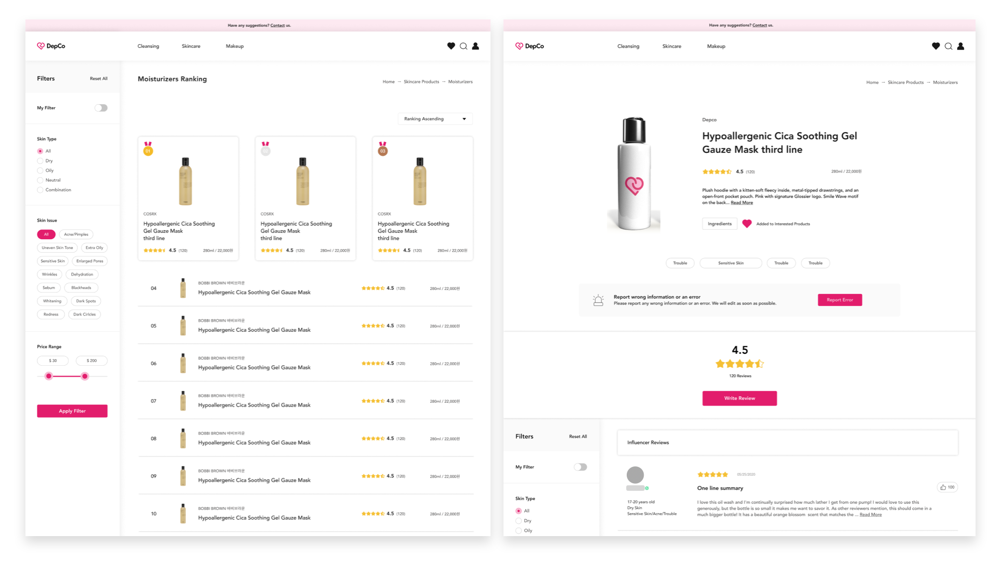

# depco

<!-- PROJECT LOGO -->
 

    

<h2 align="center">Cosmate</h2>

<strong>Depco is an AI based cosmetics products recommender and information aggregator in Vietnam. </strong>
 
 
<code>Javascript</code>
·
<code>Frontend Development</code>
·
<code>React</code>
·
<code>Redux</code> 
·
<code>REST API</code>

<!-- TABLE OF CONTENTS -->
<!---
# Table of Contents
* [About the Project](#about-the-project)
  * [Contributors](#contributors)
* [Getting Started](#getting-started)
  * [Prerequisites](#prerequisites)
  * [Running the Program](#running-the-program)
  * [Play the Game](#play-the-game)
* [Building Process](#building-process)
* [License](#license)
-->
